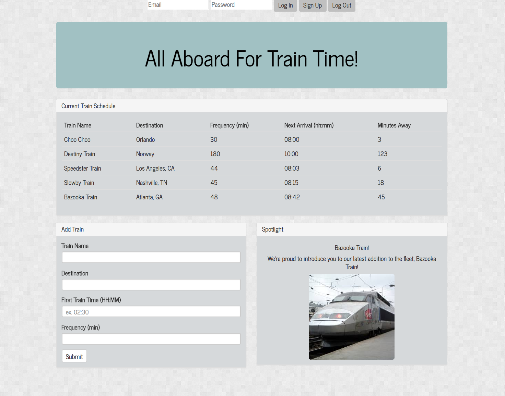

# Train Time

This is a basic train schedule built to calculate next arrival based on first train and frequency utilizing Moment.js for time calculations, Bootstrap for design, and Google's Firebase for data storage.

You'll also notice that the bottom right panel automatically updates with the most recent addition to the fleet!

